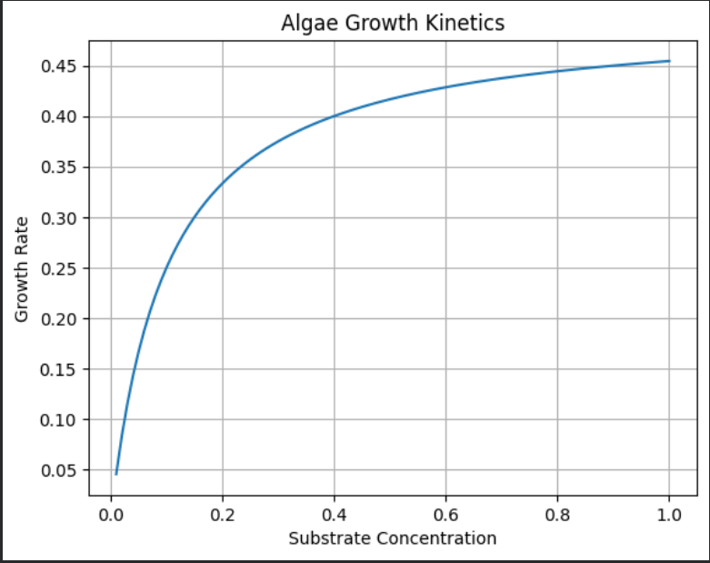
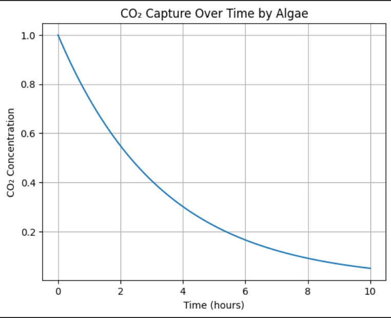

## 📄 Published Research

**Algae-Based Carbon Capture System**  
Integrated Growth Kinetics, CO₂ Sequestration & Reactor Design  

📥 [Download Full Research Paper](paper/algae_carbon_capture_paper.pdf)

# Algae-Based Carbon Capture System

## 📌 Abstract
This project investigates the use of microalgae for carbon capture using computational modeling. A data-driven simulation was developed to evaluate CO₂ absorption under varying environmental conditions.

---

## 🎯 Objectives
- Model CO₂ capture using algae systems  
- Analyze impact of light, time, and concentration  
- Develop predictive simulation model  

---

## ⚙️ Methodology

### 1. System Design
- Photobioreactor-inspired model  
- Variables: CO₂ concentration, light intensity, time  

### 2. Mathematical Model
- Monod kinetics for growth  
- Linear regression for prediction  

### 3. Simulation
- Synthetic dataset generation  
- Computational modeling using Python  

---

## 📊 Results

- CO₂ capture increases with:
  - Light intensity  
  - Exposure time  
  - CO₂ concentration  

- Strong correlation observed between variables  

---

## 📈 Results

### 1. Algae Growth Kinetics

### 2. CO₂ Capture Over Time

## 🔬 Mathematical Models

### 1. Growth Kinetics (Monod Model)
μ = μ_max * S / (K_s + S)

### 2. CO₂ Capture Model
C(t) = C₀ e^(-kt)
---

## 🧠 Discussion

The model demonstrates the feasibility of algae-based carbon capture systems as sustainable alternatives to conventional methods.

---

## ⚠️ Limitations
- Synthetic data used  
- Simplified linear modeling  

---

## 🚀 Future Work
- Nonlinear modeling  
- Experimental validation  
- Industrial-scale integration  

---

## 🛠️ Tools Used
- Python  
- NumPy  
- Matplotlib  
- Google Colab  

---
## 📚 Citation

If you reference this work:

Mupanga, L. (2026). *Algae-Based Carbon Capture System Using Computational Modeling*.

---

## 👤 Author
Lyton Mupanga
